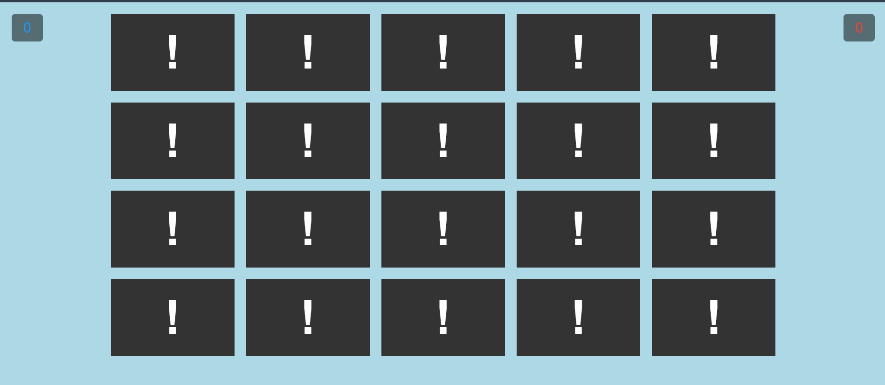
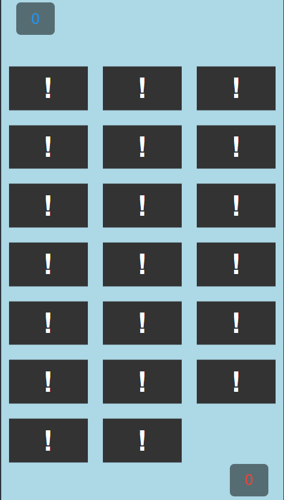

# Memory Game

A fun and interactive **2-Player Memory Card Matching Game** built with **HTML, CSS, and Vanilla JavaScript**.  
Players take turns flipping cards to find matching pairs. The player with the highest score at the end wins!

---

## Demo

* **Live Demo**: [Memory Game](https://mohamedhodaib.github.io/MemoryGame/)

---

## Screen Shots

### Desktop View


### Mobile View


---

## Introduction

Memory Game is a browser-based card matching game designed for two players.

The game consists of multiple cards placed face down in a grid layout. Each player takes turns flipping two cards:

- If the cards match → the player earns a point and continues playing.
- If the cards do not match → the cards flip back after a short delay and the turn switches.

The game ends when all pairs are matched, and the winner is automatically displayed.

---

## Table of Contents

* [Game Features](#game-features)
* [How to Play](#how-to-play)
* [Project Structure](#project-structure)
* [Game Technologies (Cards)](#game-technologies-cards)
* [Technologies Used](#technologies-used)
* [Installation](#installation)
* [Game Logic Overview](#game-logic-overview)
* [Audio Effects](#audio-effects)
* [Configuration](#configuration)
* [Responsive Design](#responsive-design)
* [Future Improvements](#future-improvements)
* [Author](#author)
* [License](#license)
* [Contributing](#contributing)

---

## Game Features

* 🎮 **Two-Player Mode**
* 🔀 **Random Card Shuffle** at the start of every game
* 🎴 **Smooth 3D Card Flip Animation**
* 🔊 **Sound Effects**
  * Success sound for matched cards
  * Fail sound for incorrect matches
* 🏆 **Automatic Score Tracking**
* 🔁 **Turn Switching System**
* 🎨 **Dynamic Background Color** based on current player
* 🛑 **Click Prevention** during card comparison
* 📱 **Fully Responsive Layout**
* 🔄 **Play Again Button** to restart the game instantly

---

## How to Play

1. Click the **Start Game** button.
2. Player 1 begins the game.
3. Click on two cards to flip them.
4. If the cards match:
   - The player earns 1 point.
   - The cards remain revealed.
   - The same player continues.
5. If the cards do not match:
   - A fail sound plays.
   - The cards flip back.
   - The turn switches to the other player.
6. Continue until all pairs are matched.
7. The game over screen will display the winner and final score.
8. Click **Play Again** to reshuffle and restart.

---

## Project Structure

```
MemoryGame/
├── index.html        # Game layout and structure
├── main.css          # Styling, animations, and responsive design
├── main.js           # Game logic and interactions
├── images/           # Technology card images
├── audio/            # Success and fail sound effects
└── README.md         # Project documentation
```

---

## Game Technologies (Cards)

The game includes matching pairs of the following technologies:

* HTML
* CSS
* Gulp
* React
* GitHub
* Jest
* Python
* Vue.js
* Angular
* MongoDB

Each technology appears twice to create matching pairs.

---

## Technologies Used

### HTML5
- Semantic layout
- Card structure
- Audio elements

### CSS3
- CSS Grid for layout
- 3D transforms (`rotateY`)
- Smooth transitions
- Media queries for responsiveness
- Animated start screen
- Dynamic backgrounds

### JavaScript (Vanilla)
- DOM manipulation
- Event listeners
- Shuffle algorithm (Fisher-Yates)
- Match checking logic
- Turn management system
- Score tracking
- Audio playback control
- Game reset functionality

---

## Installation

To run the project locally:

1. Clone the repository:

```bash
git clone https://github.com/your-username/memory-game.git
```

2. Navigate to the project folder:

```bash
cd memory-game
```

3. Open `index.html` in your browser.

No additional dependencies or build tools are required.

---

## Game Logic Overview

### Shuffle Mechanism

Cards are shuffled using a randomized order array before rendering.

### Flip Logic

* Adds `is-flipped` class when clicked
* Collects flipped cards
* Compares `data-technology` attributes

### Matching System

If matched:

* Removes `is-flipped`
* Adds `is-matched`
* Updates player score
* Plays success sound

If not matched:

* Plays fail sound
* Temporarily disables clicking
* Flips cards back after delay
* Switches active player

### Game End Detection

The game ends when:

```
document.querySelectorAll('.is-matched').length === totalCards
```

A game over panel appears displaying:

* Winner name
* Final score
* Play Again button

---

## Audio Effects

Two audio files are included:

* `success.mp3` → Played when a match is found
* `fail.mp3` → Played when a mismatch occurs

Audio is reset before playback to ensure immediate response:

```javascript
audio.currentTime = 0;
audio.play();
```

---

## Configuration

You can customize the game by modifying variables inside `main.js`.

### Flip Duration

```javascript
let duration = 1000;
```

Controls how long mismatched cards remain flipped.

---

### Player Background Colors

Modify inside these functions:

```javascript
function AddPlayer1Background() {
    document.body.style.backgroundColor = 'lightblue';
}

function AddPlayer2Background() {
    document.body.style.backgroundColor = 'lightcoral';
}
```

---

### Add or Remove Cards

To add new cards:

1. Duplicate a `.game-block` inside `index.html`
2. Change the `data-technology` attribute
3. Add the matching image inside `/images`
4. Ensure every card has exactly one matching pair

---

## Responsive Design

The grid layout adapts based on screen width:

* Desktop → 5 × 4 grid
* Tablet → 4 × 5 grid
* Mobile → 3 × 7 grid

Additional adjustments:

* Score positions change on smaller screens
* Buttons scale down
* Layout centers vertically on small devices

---

## Future Improvements

* Add single-player (vs AI) mode
* Add timer functionality
* Add difficulty levels
* Add move counter
* Add score storage using `localStorage`
* Add online multiplayer support
* Improve animations and visual effects

---

## Author

**Your Name Here**

---

## License

This project is open source and available under the **MIT License**.

---

## Contributing

Contributions are welcome!

1. Fork the repository
2. Create a new branch
3. Make improvements
4. Submit a pull request

---

🎴 Enjoy playing the Memory Game!
